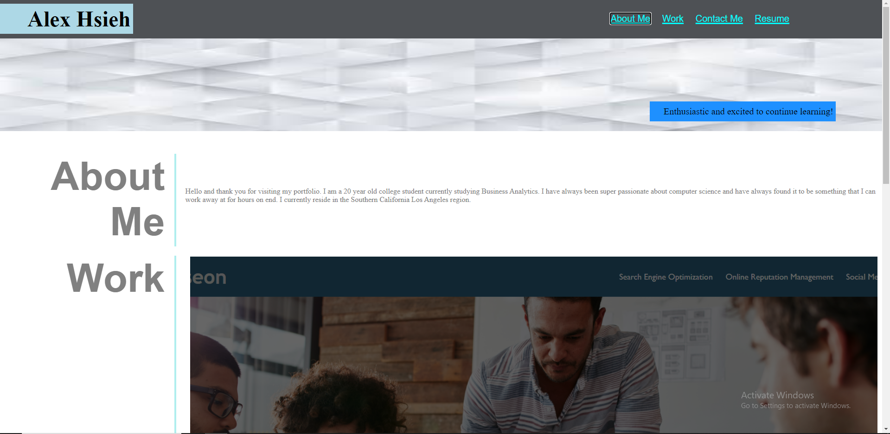
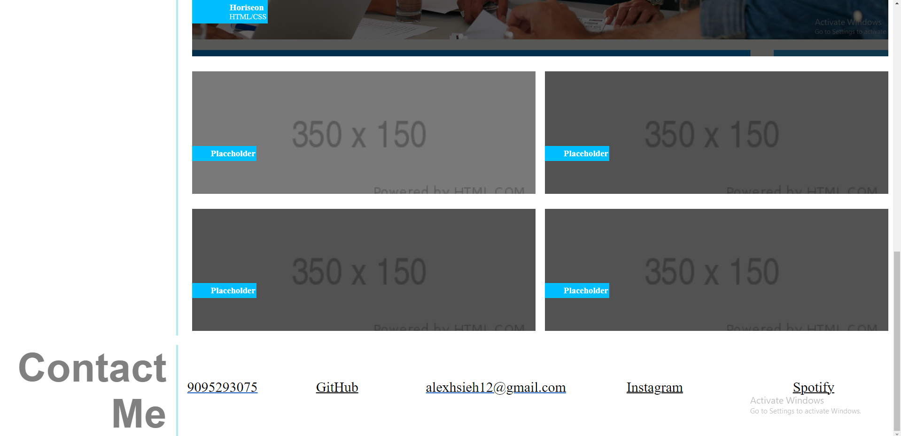

# <My Portfolio: Alex Hsieh>

## Description

My motivation for this portfolio is to create a page where all of my links and information can be accessed in one place. This is also a way for me to showcase my skills in coding and helped me to learn how to utilize flexbox and css more effectively to style and design websites to my needs. I was able to refine my skills and begin to understand more of how exactly flex boxes work as well as use the hover tools and paddings more so that I know understand more of how the container and screen sizing works.

## Table of Contents (Optional)

## Installation

My project is fully visible on GitHub and should be easily accessible. An easy way is to download the ssh and use that to open up my file application.

## Usage
I was able to create links that work and show off different tabs that I have such as resume, inistagram, spotify, and my horiseon project. I was able to do this by making everything a flexbox and incorporating the techniques that we learned in class to function the page and design the page correctly. My resume and other tabs are private and locked because I don't want to show the world yet.

[Link to my github repository for challenge 1] (https://figwheymutton.github.io/Portfolio/)
